# Turkish Wordle Solver

Wordle temelde bir kelime bulmaca oyunudur. Her gün bize 5 harfli yeni bir kelime veriliyor ve bu kelimeyi 6 deneme yaparak bulmamızı istiyor. Denemelerimiz rastgele harfler olamıyor, rastgele içerikler alamıyor, gerçekten olan Türkçe kelimeler yazmamız gerekiyor. Ayrıca yazdığımız bu harflerin konumlarına ve doğruluklarına göre bizden bilgiler ve çıkarımlar yapmamızı bekliyor.

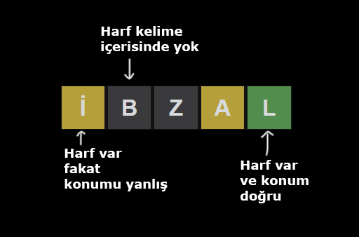

Burada biraz kısa yoldan giderek direkt Wordle sitesinden kelime listesini çekiyoruz. Böylece elimizde daha sınırlı bir kelime kümesi olacak.

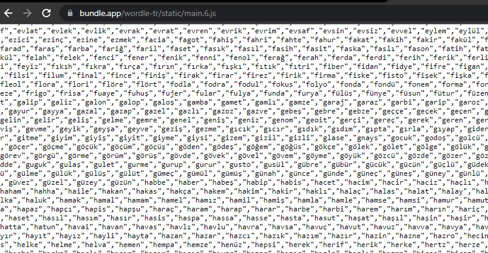

Ardından bu listeyi bir txt dosyasına kaydedip python ile açarak listeye çeviriyoruz. Tekrar eden kelimeler olabileceği için “set” ile tekrarları kaldırıyoruz.

~~~~python
# -*- coding: utf-8 -*-
import pandas as pd
from collections import Counter
import re

word_list = []
with open("kelimeler.txt",encoding="utf-8") as words:
    word_list=words.readline().replace('"','').split(",")
print(word_list)
word_list = set(word_list)
~~~~

İlk olarak düşünmemiz gereken şey hangi kelime ile başlayacağımız. Verdiğimiz kelime bize en fazla bilgi verecek kelimelerden biri olmalı ki harflerin olup olmadığına ya da doğru konumlarına göre kelime listesinde büyük ayrımlar oluşturabilelim. Oldukça sınırlı bir tahminimiz var, iyi kullanmamız gerekiyor.

Bunun için kelimelerdeki harf frekanslarına bakmaya karar verdim. Her kelimedeki harfleri ayırıp ardından bu harflerin bütün kelimelerde tekrar etme sayısına bakarak her kelimeye puan vereceğim. Böylece en çok puanı alan kelimeyi kullanacağım. Tabi oyunda 6 deneme olduğu için 3 hatta 4 hakkı kelime denemeye ayırmak da mümkün. Çünkü önce farklılıkları görüp bilgi çıkarıp sonrasında tahmin yaparsak doğruluk ihtimalimizi arttırırız.

~~~~python

letters = ['a', 'b', 'c', 'ç', 'd', 'e', 'f', 'g', 'ğ', 'h', 'ı', 'i', 'j', 'k', 'l', 'm', 'n', 'o', 'ö', 'p', 'r', 's', 'ş','t', 'u', 'ü', 'v', 'y', 'z']

base_table = pd.DataFrame(columns=["words"]+letters)

for i in word_list:
    frequency_list = dict(Counter(i))
    columns_feq = list(frequency_list.keys())
    word_deco = pd.DataFrame([[i]+list(frequency_list.values())],columns=["words"]+columns_feq)
    base_table = pd.concat([base_table,word_deco],ignore_index=True)
base_table.to_csv("base_table.csv",index=False)
a = pd.read_csv("base_table.csv")
print(a)

~~~~

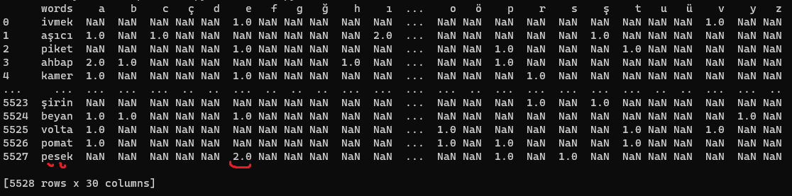

Her bir kolonu kendi içerisinde toplayarak değerlendiriyoruz böylece her bir harfin frekans toplamını, görülme sıklığını bulacağız.

~~~~python

base_table = pd.read_csv("base_table.csv")
frame = pd.DataFrame(columns=["letter","l_frequency"])

for i in base_table.columns[1:]:
    f_kur = pd.DataFrame([[i,base_table[i].sum()]],columns=["letter","l_frequency"])
    frame = pd.concat([frame,f_kur],ignore_index=True)
o_frequency = frame.sort_values("l_frequency",ascending=False)
o_frequency["weight"] = range(29,0,-1)
o_frequency["w_score"] = 0
print(o_frequency)

~~~~

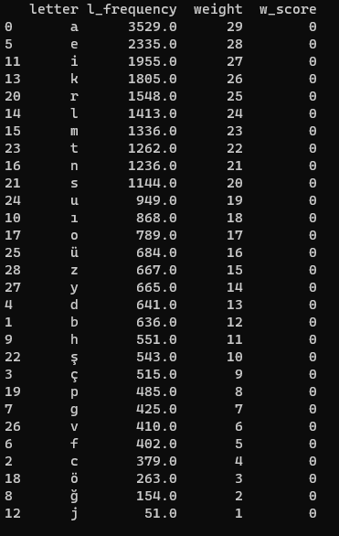

Puanlama için en alttan yukarı doğru bu harflere (1–29)/10 puan vermeye karar verdim.

Böylece bir kelimede geçen “önemli” puana sahip harflere göre o kelimeye değer vermiş olacağız.

Kelimelere puan verirken tekrar eden harflerden kaçınmalıyız.

Örneğin “ARABA” içerisinde 3 tane “A” harfi var. Bu kelime yüksek bir puan alacak fakat bize vereceği bilgi çok az çünkü 3 kere “A” tekrar ediyor. Bize gereken en yüksek puana sahip ve farklı harflerden oluşan kelimeler.

~~~~python

base_table = pd.read_csv("base_table.csv")
frame = pd.DataFrame(columns=["letter","l_frequency"])

for i in base_table.columns[1:]:
    f_kur = pd.DataFrame([[i,base_table[i].sum()]],columns=["letter","l_frequency"])
    frame = pd.concat([frame,f_kur],ignore_index=True)
o_frequency = frame.sort_values("l_frequency",ascending=False)
o_frequency["weight"] = range(29,0,-1)
o_frequency["w_score"] = 0

scorboard = base_table.copy()
scorboard["score"] = 0
for i in word_list:
    w_score = 0
    for w in set(i):
        values = o_frequency[o_frequency["letter"]==w]["weight"].item()/10
        w_score += values
        scorboard.loc[scorboard['words'] == i, 'score'] = w_score
contents = scorboard[["words","score"]].sort_values(by=["score"],ascending=False)
contents.to_csv("letter_frequency_results.csv",index=False)

a = pd.read_csv("letter_frequency_results.csv")
print(a)

~~~~

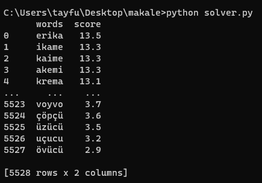

*erika : isim, bitki bilimi : Süpürge otu*

Burada görüldüğü gibi en yüksek puanı alan kelime “ERİKA”. İzlediğim yolda bu kelime, bize sorulan kelimenin ne olup olamayacağına dair en fazla bilgiyi verecek olan kelime olarak görülüyor.

Fakat tam olarak yeterli değil. Biz bu kelimeyi girdiğimizde kodun “tahmin” kısmı bize bulunan bilgilere sahip, yani ilişkili kelimeleri önerecek. Bu yüzden öncelikle elimizde olabildiğince çok bilgi olmasını istiyoruz ki tahmin ihtimalimiz artsın. Benzerlik içerisinde tahminlere kaybolmadan önce farklılıklarla bilgi toplamaya odaklanıyoruz.

İçerisinde [e,r,i,k,a] harfleri geçmeyen en yüksek puana sahip diğer kelimeyi arıyoruz.

~~~~python

contents = scorboard[["words","score"]].sort_values(by=["score"],ascending=False)
for i in contents["words"]:
        if len(re.sub(r"[erika]", "", str(i))) == 5:
            print(i)
~~~~

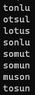

*tonlu : sıfat, dil bilgisi : Yumuşak*

Şimdi aynı şeyi tekrar yapıyoruz alabildiğimiz kadar farklılık bilgisi istiyoruz.

~~~~python

contents = scorboard[["words","score"]].sort_values(by=["score"],ascending=False)
for i in contents["words"]:
        if len(re.sub(r"[erikatonlu]", "", str(i))) == 5:
            print(i)

~~~~

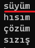

*süyüm : isim, halk ağzında : İğneye geçirilen bir sap iplik.*

Görüldüğü gibi “SÜYÜM” kelimesinde “Ü” 2 kere tekrar ediyor. Bunu bir sınır olarak alıyoruz çünkü artık harfler tekrar ediyor ve bir sonrakinde zaten tek seçenek olarak “hıfız” geliyor. Artık tekrar artıyor. Bu yüzden gireceğimiz temel 3 bilgi kelimesi oluşuyor.

        Erika , Tonlu , Süyüm

Bu kelimeleri girdikten sonra bize 3 kelime hakkı kalıyor. Bilgileri kullanarak kelimeyi 3 denemede tahmin etmeye çalışacağız.

Her gelen bilgiyi girdiğimiz basit ve regex’ler ile çalışan bir betiğe gönderiyoruz. While ile döngüye alıyoruz ve her girilen bilgide ana yığını arındırıyoruz. Puanlara göre sıralanmış kelimeler arasından en iyi olasılıklı kelime karşımıza geliyor. Girebileceğimiz en iyi seçenek bu kelime olacak. Tüm bilgileri girdikten sonra gelen en iyi seçeneği oynumuza giriyoruz ve bunu devam ettiriyoruz. Bu şekilde kelimemizi bulmaya çalışıyoruz.

Eğer bir harf hem kelimenin içinde hem de kelimenin içinde değil görünüyorsa 2 tane olmadığı anlamına geliyor onu içerisinde yok olarak girmemek gerekir.

~~~~python

# -*- coding: utf-8 -*-

import pandas as pd
import re

print("""

### Enter letters separated by commas
### Do not use commas after the last letter
### If there is no information, press enter and skip that part
                                        TayfunBasoglu
""")

read = pd.read_csv("letter_frequency_results.csv")

while True:
    #part 1
    letters_inside = input("\n\nLetters in the word - location unknown (like : a,b,c)\n\n --- >    ").replace(" ", "")
    letters_inside = letters_inside.split(",")
    if letters_inside:
        reg = '^'
        for i in letters_inside:
            reg += "(?=.*"+i+")"
        read = read[read["words"].str.contains(""+reg+"",regex= True, na=False)]
        print(read.head(10))
    else:
        pass
        
    #part 2
    letters_n_inside = input("\n\nLetters not in the word (like : a,b,c)\n\n --- >    ").replace(" ", "")
    letters_n_inside = letters_n_inside.split(",")
    try:
        if letters_n_inside:
            for i in letters_n_inside:
                read = read[~read["words"].str.contains("[{}]".format(i))]
            print(read.head(10))
    except:
        pass

    #part 3
    letters_location  = input("\n\nKnown letters location (like : 1b,2c,3a)\n\n --- >    ").replace(" ", "")
    if letters_location:
        b = letters_location.split(",")
        space = [".",".",".",".","."]
        for i in b:
            space[int(i[0])-1] = i[1]
        formul = "".join(space)
        read = read[read["words"].str.contains(""+formul+"",regex= True, na=False)]
        print(read.head(10))
    else:
        pass

~~~~

<code>21 Şubat 2022 tarihi ile bir deneme yapıyoruz.</code> İlk olarak bize bilgiler sağlayacak olan 3 kelimemizi direkt giriyoruz.

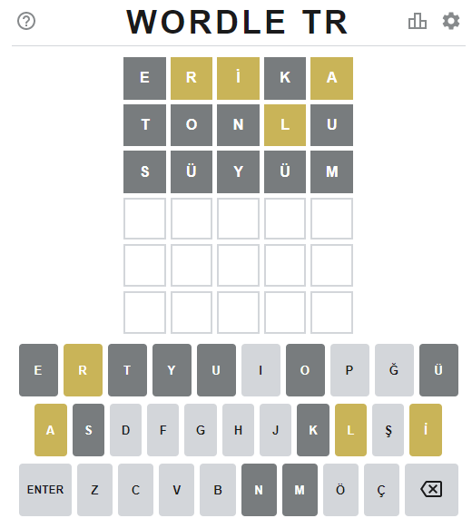

Burada içerisinde olan ve olmayan harfleri yardımcımıza veriyoruz. Her bilgi girildiğinde bize olası en iyi sonuçları veriyor. Elimizdeki tüm bilgileri giriyoruz.

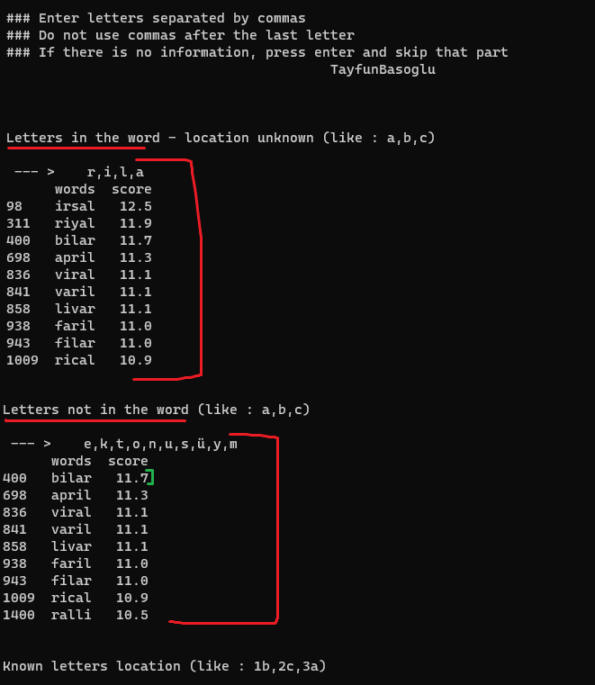

Elimizde daha fazla bilgi yok bu yüzden en iyi tahmini yazıyoruz “BİLAR ”ve tekrar gelen bilgileri giriyoruz. Kod verdiğimiz bilgileri tuttuğu için aynı harfleri tekrar girmemize gerek yok. Eğer yeni bilgi yoksa enter diyerek geçebiliriz.

Konum bilgisi yok enter ile geçiyorum.

Olan harfler aynı tekrar geçiyorum.

Kelime içerisinde olmayan harf kısmına “b” giriyorum.

Bu durumda yeni en iyi kelimemiz April oluyor.

*April : isim, halk ağzında, İngilizce april : Nisan* İngilizce bir kelime ama hem TDK'da hem de wordle listesinde mevcut.

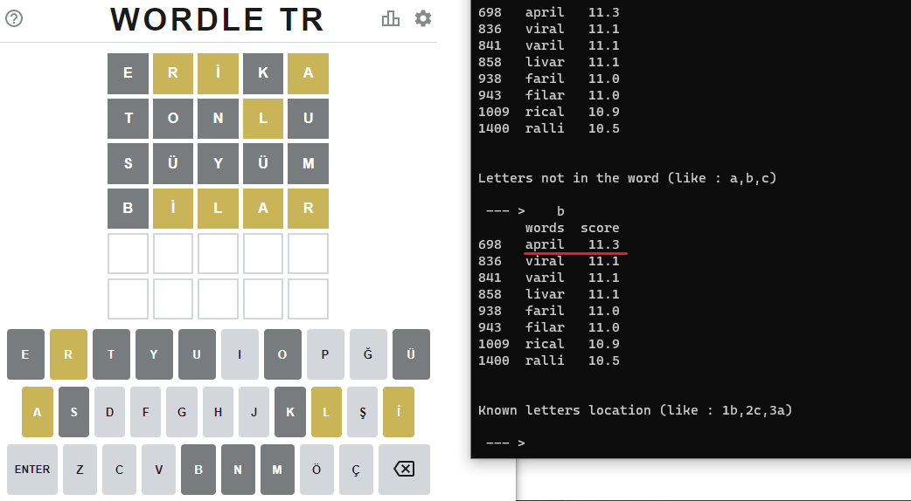

Tekrar kelimeyi giriyoruz ve bilgilere bakıyoruz.

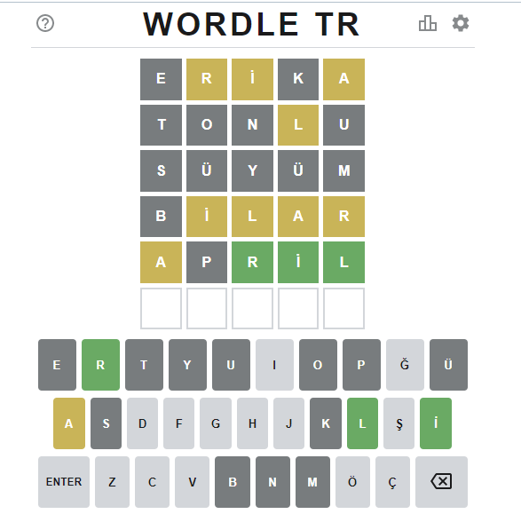

Artık çok büyük bir bilgiye ulaştık. Şimdi konum bilgilerini ve olmayan kelime bilgisini giriyoruz. (a’yı girmiştik daha önce)

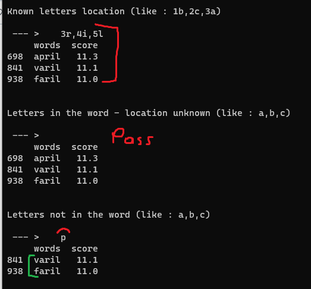

Burada karşımıza 2 seçenek geliyor. İzlediğimiz yolla alabileceğimiz tüm bilgileri aldık ve karşımıza bu sonuç geldi. Bu gibi 2 sonuç olan durumlarda malesef iş bizim tahminimize, daha doğrusu seçimimize dayanıyor. Başka bir hakkımız olsa tutturabiliriz tabi ki fakat kısıtlı bilgi ve deneme altında bugünün kelimesinde buradan öteye geçemiyoruz.

Bu yüzden daha fazla puan alan kelimeyi girmek temel bir yaklaşım olur. Kelimemizi girdiğimizde doğru tahmini görüyoruz.

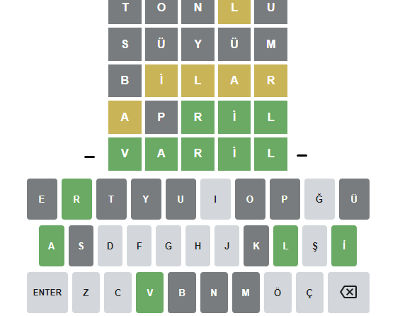

**Genel bakışla işleyişi görmek için bir gif**

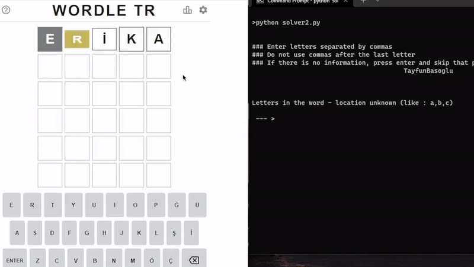

**22 Şubat 2022**

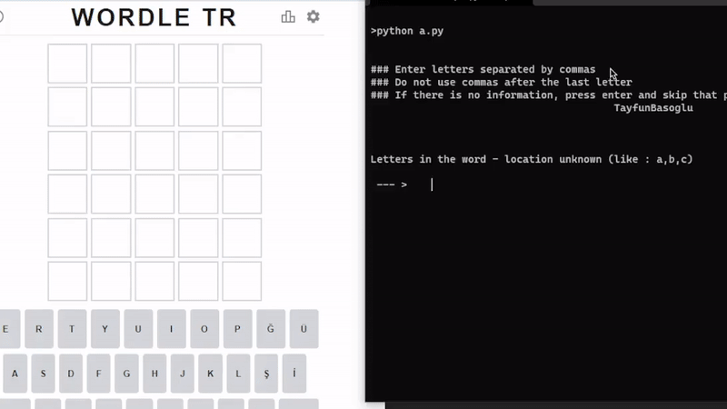

https://medium.com/@tayfunbasoglu/turkish-wordle-solver-f0ef30640809
